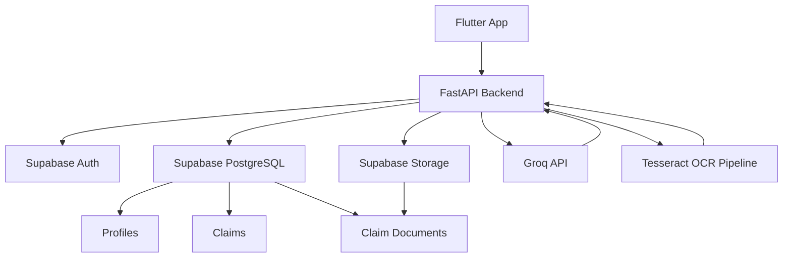

# ClaimPilot Backend Documentation

This file is the authoritative backend reference for the ClaimPilot project. It is written for another AI coding agent, not for human browsing. The goal is to make the backend understandable without manually inspecting every module.

This document reflects the current implementation in the repository as of 2026-07-01.

---

# 1. Project Overview

## What ClaimPilot is

ClaimPilot is an AI-powered insurance and warranty claims processing platform. The backend exists to support a mobile-first workflow in which users can:

- register and authenticate
- create insurance or warranty claims
- upload supporting documents
- run OCR on uploaded files
- send extracted document text to an AI model for analysis
- retrieve claim readiness and structured claim information

The backend is designed to be the coordination layer between:

- Flutter mobile clients
- Supabase Auth and PostgreSQL
- Supabase Storage
- Groq LLM inference
- OCR tooling (Tesseract + OCR preprocessing)

## Purpose of the backend

The backend is responsible for:

- user authentication and identity management
- claim lifecycle management
- document upload and metadata tracking
- OCR orchestration
- AI analysis of claim evidence
- storage path and signed URL generation
- enforcing access control using Supabase Row Level Security (RLS)
- returning structured API responses to the frontend

## Overall workflow

The expected end-to-end workflow is:

1. User registers or logs in.
2. User creates a claim.
3. User uploads one or more supporting documents.
4. Backend stores the file in Supabase Storage.
5. Backend records document metadata in the database.
6. OCR is run on the document.
7. OCR text is sent to Groq for structured claim analysis.
8. The backend stores summary, structured fields, readiness score, and missing info on the claim.
9. Flutter client displays the result to the user.

## Main technologies

- Python 3.x
- FastAPI for API routing and request handling
- Pydantic for request/response validation
- Supabase Python client for auth, database, and storage
- PostgreSQL through Supabase
- Row Level Security for per-user data isolation
- Tesseract OCR via pytesseract
- OpenCV and Pillow for preprocessing
- pdf2image for PDF-to-image conversion
- Groq API for LLM-based analysis
- Uvicorn as ASGI server

## Architecture

The backend follows a layered structure:

- API layer: FastAPI routers
- Middleware layer: JWT validation and auth dependency
- Service layer: business logic
- Database layer: Supabase clients and dependency injection
- Schema layer: Pydantic request/response contracts
- Storage layer: Supabase Storage integration
- AI/OCR layer: external processing services

The dominant flow is:

Router -> Service -> Supabase / Storage / Groq / OCR

## Design principles

The codebase currently follows these principles:

- thin routers
- business logic in services
- dependency injection via FastAPI Depends
- standardized success response wrapper
- custom exceptions for business and infrastructure failures
- RLS-based access control for user data
- use of admin client for privileged operations while user-scoped client is used for user-owned data
- keep the API contract simple and predictable for Flutter

---

# 2. Folder Structure

## Root structure

```text
backend/
├── app/
│   ├── ai/
│   ├── api/
│   │   └── v1/
│   ├── core/
│   ├── database/
│   ├── exceptions/
│   ├── middleware/
│   ├── models/
│   ├── schemas/
│   ├── services/
│   ├── skills/
│   ├── tests/
│   ├── tools/
│   ├── utils/
│   ├── config.py
│   ├── main.py
│   └── __init__.py
├── migrations/
├── requirements.txt
└── README_BACKEND.md
```

## Important folders

### app/
The main application package. All backend runtime code lives here.

### app/api/
HTTP endpoint layer. Contains route modules for auth, claims, documents, health, database, and users.

### app/api/v1/
Versioned API namespace. The project currently uses the v1 API structure.

### app/services/
Business logic layer. Contains services for authentication, claims, documents, AI, OCR, storage, users, and health.

### app/schemas/
Pydantic schemas for request and response validation. These define the backend contract.

### app/middleware/
Middleware and request-scoped dependencies. The main auth middleware lives here.

### app/database/
Supabase client factories and dependency providers. This is the boundary between FastAPI and Supabase.

### app/core/
Core infrastructure: settings, CORS, logging, lifespan, security helpers.

### app/exceptions/
Custom exception classes used by services and routers.

### app/utils/
Shared response helpers.

### app/ai/
Prompt templates and AI-related prompt construction logic.

### app/tests/
Unit tests for claim and document services.

### app/skills/, app/tools/
Reserved for future or agent-oriented capabilities. Currently not heavily implemented in the current runtime flow.

### migrations/
SQL migrations that define the relational schema, storage bucket setup, and RLS policies.

---

# 3. Backend Architecture

## FastAPI

The application is a FastAPI app created in [app/main.py](app/main.py). It:

- configures the app title/version/description
- applies CORS
- includes the versioned router
- defines a root endpoint
- exposes OpenAPI through custom_openapi

FastAPI routes are mounted through the API router in [app/api/v1/router.py](app/api/v1/router.py).

## Supabase

Supabase is used for three major concerns:

- Auth: user identity, login, registration, JWT verification
- Database: claims, documents, profiles, audit logs, etc.
- Storage: document file persistence

The backend uses two kinds of Supabase clients:

- admin client: service-role bypass for privileged operations
- user client: JWT-scoped client that respects RLS

The client factories are in [app/database/client.py](app/database/client.py).

## JWT Authentication

Authentication is JWT-based, but the actual verification is delegated to Supabase Auth. The backend extracts the token from the Authorization header and validates it using Supabase Auth via `get_user`.

## Service Layer

The service layer is the main place for business logic. The routes are intentionally thin and mostly:

- read request data
- resolve dependencies
- call a service
- map exceptions to HTTP responses

Example services:

- AuthService
- ClaimService
- DocumentService
- OCRService
- AIService
- StorageService
- ProfileService
- UserService
- HealthService

## Repository Pattern

There is no formal repository pattern implemented in the current backend. The implementation uses services that directly interact with Supabase client queries. This is a direct service + client approach rather than a repository abstraction.

## Dependency Injection

FastAPI dependency injection is used throughout. Examples:

- `Depends(get_current_user)` for auth
- `Depends(get_user_client)` for user-scoped Supabase access
- `Depends(get_admin_client)` for privileged access

This design keeps the route handlers simple and testable.

## Middleware

The main middleware is the current-user dependency in [app/middleware/auth.py](app/middleware/auth.py). It:

- extracts the JWT from the Authorization header
- validates it through Supabase Auth
- returns a user object for the route handler

## Request lifecycle

1. Client sends an HTTP request.
2. FastAPI route function is invoked.
3. Required dependencies are resolved.
4. Request body is validated by Pydantic.
5. Route calls the appropriate service.
6. Service performs business logic and external I/O.
7. Service returns data to the route.
8. Route wraps it in the standard response format.
9. FastAPI returns HTTP response.

## Response lifecycle

1. Service returns domain data or raises a custom exception.
2. Router catches or translates it into HTTPException.
3. Response is wrapped in the common API response object.
4. JSON is returned to Flutter client.

---

# 4. Authentication

## Overview

Authentication is handled through Supabase Auth, not a custom password hashing implementation. The backend uses the Supabase Python client for sign-up and sign-in operations. JWTs are validated by calling Supabase Auth's `get_user`.

## Endpoints

### POST /auth/register

Registers a new user.

- Authentication required: No
- Uses: admin client because user creation is a privileged operation
- Request body: email, password, full_name
- Response: success wrapper with no user data
- On failure: HTTP 400 with error string

### POST /auth/login

Authenticates a user and returns a Supabase session object.

- Authentication required: No
- Uses: admin client for sign-in
- Request body: email, password
- Response: success wrapper with session data including access_token and refresh_token
- On failure: HTTP 401

## JWT

The backend does not mint JWTs itself. It relies on Supabase Auth. The login endpoint returns a session payload that contains:

- access_token
- refresh_token
- expires_in
- token_type
- user metadata

The Authorization header is expected to carry the access token.

## Authorization header

Clients must send:

```http
Authorization: Bearer <access_token>
```

## Protected routes

The following routes require authentication:

- GET /users/me
- POST /claims
- GET /claims
- GET /claims/{claim_id}
- PATCH /claims/{claim_id}
- POST /claims/{claim_id}/analyze
- DELETE /claims/{claim_id}
- POST /documents/claims/{claim_id}
- GET /documents/claims/{claim_id}
- GET /documents/{document_id}
- POST /documents/{document_id}/extract
- GET /documents/{document_id}/download
- DELETE /documents/{document_id}

## Current user middleware

The middleware in [app/middleware/auth.py](app/middleware/auth.py) resolves the current user from the JWT and returns the Supabase user object. The route handlers use this object to derive the authenticated `user.id`.

## Supabase Auth

The backend uses:

- `auth.sign_up(...)` for registration
- `auth.sign_in_with_password(...)` for login
- `auth.get_user(...)` for JWT validation

## Login flow

1. Flutter sends email/password to `/auth/login`.
2. Backend calls Supabase Auth sign-in.
3. Supabase returns a session.
4. Backend returns that session in the standard response wrapper.
5. Flutter stores the token locally and sends it on future requests.

## Register flow

1. Flutter sends email, password, full_name to `/auth/register`.
2. Backend calls Supabase Auth sign-up.
3. Backend creates a profile record in the `profiles` table.
4. Backend returns success.

## Logout behavior

There is no explicit logout endpoint in the current backend. The authentication model is stateless; the client is expected to discard the local token. The backend does not invalidate JWTs server-side in this implementation.

---

# 5. Database

## Database system

The backend is backed by Supabase PostgreSQL. The schema is defined in the SQL migrations under [migrations](migrations).

## Tables

### profiles

Purpose:
- extend Supabase auth.users with application-specific profile data

Columns:
- id (UUID, PK, FK to auth.users.id)
- full_name (TEXT)
- email (TEXT, unique)
- avatar_url (TEXT, nullable)
- role (user_role enum: user/admin)
- created_at (TIMESTAMPTZ)
- updated_at (TIMESTAMPTZ)
- deleted_at (TIMESTAMPTZ, nullable)

Relationships:
- one profile per Supabase Auth user
- referenced by claims and audit_logs

Foreign keys:
- `profiles.id -> auth.users.id`

Soft delete:
- `deleted_at` exists, but the current service layer does not actively use it for profiles

Indexes:
- none explicitly defined beyond uniqueness on email

RLS behavior:
- users can view/update/insert only their own profile

### claims

Purpose:
- stores insurance or warranty claims created by users

Columns:
- id (UUID, PK)
- claim_number (TEXT, unique)
- user_id (UUID, FK to profiles.id)
- title (TEXT)
- description (TEXT)
- claim_type (TEXT)
- status (claim_status enum)
- current_stage (claim_stage enum)
- readiness_score (SMALLINT)
- confidence_score (SMALLINT)
- ai_summary (TEXT)
- structured_data (JSONB, added in migration 004)
- ai_processed_at (TIMESTAMPTZ, added in migration 004)
- created_at (TIMESTAMPTZ)
- updated_at (TIMESTAMPTZ)
- deleted_at (TIMESTAMPTZ)

Relationships:
- many claims belong to one profile
- many claim_documents belong to one claim
- many agent_runs belong to one claim
- many audit_logs can point to one claim

Foreign keys:
- `claims.user_id -> profiles.id`

Soft delete:
- soft delete is implemented by setting `deleted_at`

Indexes:
- idx_claims_user_id
- idx_claims_status
- idx_claims_stage
- idx_claims_deleted_at
- idx_claims_created_at

RLS behavior:
- users can manage only claims where `auth.uid() = user_id`

### claim_documents

Purpose:
- stores metadata for documents uploaded for a claim

Columns:
- id (UUID, PK)
- claim_id (UUID, FK to claims.id)
- file_name (TEXT)
- storage_path (TEXT)
- document_type (document_type enum)
- extracted_text (TEXT)
- upload_status (document_status enum)
- ocr_confidence (REAL, added in migration 004)
- created_at (TIMESTAMPTZ)
- updated_at (TIMESTAMPTZ)
- deleted_at (TIMESTAMPTZ)

Relationships:
- belongs to exactly one claim

Foreign keys:
- `claim_documents.claim_id -> claims.id`

Soft delete:
- soft delete via `deleted_at`

Indexes:
- idx_claim_documents_claim_id
- idx_claim_documents_type
- idx_claim_documents_status
- idx_claim_documents_deleted_at

RLS behavior:
- users can access documents only if the parent claim belongs to them

### agent_runs

Purpose:
- logs AI agent invocations for claims

Columns:
- id (UUID)
- claim_id (UUID, FK)
- agent_name (TEXT)
- status (agent_status enum)
- started_at (TIMESTAMPTZ)
- finished_at (TIMESTAMPTZ)
- duration_ms (INTEGER)
- input_tokens (INTEGER)
- output_tokens (INTEGER)
- result (JSONB)
- created_at (TIMESTAMPTZ)
- updated_at (TIMESTAMPTZ)
- deleted_at (TIMESTAMPTZ)

Relationships:
- belongs to one claim

Foreign keys:
- `agent_runs.claim_id -> claims.id`

Soft delete:
- yes, via `deleted_at`

Indexes:
- idx_agent_runs_claim_id
- idx_agent_runs_status
- idx_agent_runs_created_at
- idx_agent_runs_deleted_at

RLS behavior:
- users can view runs only for their claims

### audit_logs

Purpose:
- stores operational and user activity events

Columns:
- id (UUID)
- user_id (UUID, FK to profiles.id)
- claim_id (UUID, FK to claims.id)
- action (TEXT)
- details (JSONB)
- created_at (TIMESTAMPTZ)
- updated_at (TIMESTAMPTZ)
- deleted_at (TIMESTAMPTZ)

Relationships:
- optional link to a user and claim

Foreign keys:
- `audit_logs.user_id -> profiles.id`
- `audit_logs.claim_id -> claims.id`

Soft delete:
- yes, via `deleted_at`

Indexes:
- idx_audit_logs_user_id
- idx_audit_logs_claim_id
- idx_audit_logs_action
- idx_audit_logs_created_at
- idx_audit_logs_deleted_at

RLS behavior:
- users can view their own audit logs

## Storage bucket

The backend expects a Supabase Storage bucket named `claim-files`.

Configuration from migration 002:

- private bucket
- 10MB size limit
- allowed MIME types: pdf, jpeg, png, webp

---

# 6. API Endpoints

The API is mounted under `/` with versioned routes in the `v1` router. The current implementation mostly uses the root path plus `/auth`, `/users`, `/claims`, `/documents`.

## Health endpoints

### GET /health

- Purpose: basic health check
- Authentication required: No
- Request body: none
- Response body:

```json
{
  "success": true,
  "message": "API is healthy.",
  "data": {
    "environment": "development",
    "version": "1.0.0"
  },
  "errors": null
}
```

- Possible errors: none in current implementation

### GET /database

- Purpose: check whether the database is reachable
- Authentication required: No
- Request body: none
- Response body: success or error wrapper
- Possible errors: database connection issues

## Authentication endpoints

### POST /auth/register

- Purpose: create a Supabase Auth user and profile row
- Authentication required: No
- Request body:

```json
{
  "email": "user@example.com",
  "password": "supersecret",
  "full_name": "Jane Doe"
}
```

- Response body:

```json
{
  "success": true,
  "message": "Registration successful.",
  "data": null,
  "errors": null
}
```

- Possible errors: invalid input, Supabase signup failure, profile creation failure

### POST /auth/login

- Purpose: authenticate and return a session payload
- Authentication required: No
- Request body:

```json
{
  "email": "user@example.com",
  "password": "supersecret"
}
```

- Response body:

```json
{
  "success": true,
  "message": "Login successful.",
  "data": {
    "access_token": "...",
    "refresh_token": "...",
    "expires_in": 3600,
    "token_type": "bearer"
  },
  "errors": null
}
```

- Possible errors: invalid credentials, no session returned

## User endpoints

### GET /users/me

- Purpose: return the authenticated user identity
- Authentication required: Yes
- Request body: none
- Response body:

```json
{
  "success": true,
  "message": "Authenticated user.",
  "data": {
    "id": "<uuid>",
    "email": "user@example.com"
  },
  "errors": null
}
```

## Claim endpoints

### POST /claims

- Purpose: create a new claim draft
- Authentication required: Yes
- Request body:

```json
{
  "title": "Hospital Bill",
  "description": "Medical invoice for treatment",
  "claim_type": "Medical"
}
```

- Response body:

```json
{
  "success": true,
  "message": "Claim created successfully.",
  "data": {
    "id": "<uuid>",
    "claim_number": "CP-20260701123456-ABC12345",
    "user_id": "<uuid>",
    "title": "Hospital Bill",
    "description": "Medical invoice for treatment",
    "claim_type": "Medical",
    "status": "draft",
    "current_stage": "upload",
    "readiness_score": 0,
    "confidence_score": 0,
    "ai_summary": null,
    "deleted_at": null
  },
  "errors": null
}
```

- Possible errors: validation error, database error

### GET /claims

- Purpose: list all non-deleted claims for the current user
- Authentication required: Yes
- Request body: none
- Response body: array of claim objects inside `data`

### GET /claims/{claim_id}

- Purpose: retrieve one claim by ID
- Authentication required: Yes
- Request body: none
- Response body: single claim object inside `data`
- Possible errors: 404 if not found or deleted

### PATCH /claims/{claim_id}

- Purpose: update user-editable fields on a claim
- Authentication required: Yes
- Request body:

```json
{
  "title": "Updated title"
}
```

- Response body: updated claim object inside `data`
- Possible errors: validation, not found, database error

### POST /claims/{claim_id}/analyze

- Purpose: run OCR-based AI analysis for a claim
- Authentication required: Yes
- Request body: none
- Response body:

```json
{
  "success": true,
  "message": "Claim analyzed successfully.",
  "data": {
    "claim": { "id": "..." },
    "analysis": {
      "summary": "...",
      "structured_data": {
        "claim_type": "Medical",
        "claimant_name": "Jane Doe"
      },
      "important_entities": ["Hospital"],
      "missing_information": ["Policy number"],
      "readiness_score": 72
    }
  },
  "errors": null
}
```

- Possible errors: no documents, no OCR text, AI error, database error

### DELETE /claims/{claim_id}

- Purpose: soft delete a claim
- Authentication required: Yes
- Request body: none
- Response body: updated claim object inside `data`
- Possible errors: not found, database error

## Document endpoints

### POST /documents/claims/{claim_id}

- Purpose: upload a document for a claim
- Authentication required: Yes
- Request body: multipart/form-data with:
  - file
  - document_type (optional, defaults to `other`)
- Response body:

```json
{
  "success": true,
  "message": "Document uploaded successfully.",
  "data": {
    "id": "<uuid>",
    "claim_id": "<uuid>",
    "file_name": "unique-name.pdf",
    "storage_path": "user-id/claim-id/unique-name.pdf",
    "document_type": "receipt",
    "upload_status": "uploaded",
    "extracted_text": null,
    "ocr_confidence": null,
    "created_at": "2026-07-01T00:00:00Z",
    "updated_at": "2026-07-01T00:00:00Z"
  },
  "errors": null
}
```

- Possible errors: unsupported MIME type, file size too large, storage error, DB error

### GET /documents/claims/{claim_id}

- Purpose: list documents belonging to a claim
- Authentication required: Yes
- Request body: none
- Response body: array of documents inside `data`

### GET /documents/{document_id}

- Purpose: retrieve one document
- Authentication required: Yes
- Request body: none
- Response body: single document object inside `data`

### POST /documents/{document_id}/extract

- Purpose: run OCR on a document
- Authentication required: Yes
- Request body: none
- Response body: updated document metadata with extracted text and OCR confidence
- Possible errors: invalid file type, OCR failure, storage download failure

### GET /documents/{document_id}/download

- Purpose: generate a signed temporary download URL
- Authentication required: Yes
- Request body: none
- Response body:

```json
{
  "success": true,
  "message": "Download URL generated successfully.",
  "data": {
    "download_url": "https://..."
  },
  "errors": null
}
```

### DELETE /documents/{document_id}

- Purpose: soft delete a document and remove it from storage
- Authentication required: Yes
- Request body: none
- Response body: success wrapper with no data

---

# 7. Claims Module

## Create Claim

The create claim flow starts with a POST to `/claims`. The router injects the current user and a user-scoped client. The service validates required fields and creates a claim with these defaults:

- status: `draft`
- current_stage: `upload`
- deleted_at: null
- claim number: generated as `CP-<timestamp>-<hex>`

## List Claims

GET `/claims` returns all non-deleted claims for the current user. It filters rows where `deleted_at IS NULL`.

## Update Claim

PATCH `/claims/{claim_id}` updates only user-editable fields:

- title
- description
- claim_type

The service does not allow changing status or internal AI fields from the public route.

## Delete Claim

DELETE `/claims/{claim_id}` performs a soft delete by setting `deleted_at` to the current timestamp. The record is not physically removed.

## Analyze Claim

POST `/claims/{claim_id}/analyze` loads all OCR text from active claim documents, merges it, sends the combined text to Groq, and stores the analysis into the claim record.

## Current status

The current claim lifecycle is intentionally simple:

- draft
- upload
- OCR processing
- AI analysis
- readiness result

The backend does not yet implement a full multi-agent workflow beyond the single AI analysis step.

## Workflow

1. claim created
2. documents uploaded
3. documents OCR processed
4. claim analyzed
5. claim readiness score updated
6. frontend shows result

---

# 8. Documents Module

## Upload

Upload is performed through POST `/documents/claims/{claim_id}`. The route accepts multipart file upload and a form field `document_type`.

The service:

1. validates MIME type
2. reads file bytes
3. validates size
4. generates a unique filename
5. uploads to Supabase Storage
6. inserts metadata into `claim_documents`

## Download

GET `/documents/{document_id}/download` generates a signed temporary URL using Supabase Storage.

## OCR

POST `/documents/{document_id}/extract` performs OCR by:

1. loading the document metadata
2. generating a signed URL
3. downloading the file
4. running OCR
5. saving OCR text and confidence
6. updating `upload_status` to `processed`

## Delete

DELETE `/documents/{document_id}` deletes the underlying storage object and soft deletes the database record.

## List

GET `/documents/claims/{claim_id}` lists all non-deleted documents for a claim.

## Supported formats

The storage service and OCR service currently support:

- application/pdf
- image/jpeg
- image/png
- image/webp

## Storage paths

Storage paths are generated as:

```text
<user_id>/<claim_id>/<filename>
```

Example:

```text
8a7c7d3d-1234-4444-8b33-2db7c756a1f2/4c5e7fd9-1e2b-4e4f-9bb7-5f0ad5c63f22/receipt.pdf
```

## Signed URLs

The backend generates signed URLs with an expiration of 300 seconds by default. These are used for secure temporary access to storage objects.

## OCR pipeline

- Document is fetched from storage through a signed URL.
- OCR service downloads it.
- Image preprocessing improves OCR results.
- Tesseract extracts text.
- The result is stored back on the document record.

---

# 9. OCR

## Tesseract

The OCR service uses Tesseract with the configuration:

```text
--oem 3 --psm 6
```

The binary path is set explicitly to:

```text
D:\Program Files\Tesseract-OCR\tesseract.exe
```

## PDF processing

PDFs are converted page-by-page using `pdf2image.convert_from_path` into images at 300 DPI. Each page is preprocessed and OCR'd independently, and the resulting text is joined into a single string.

## Image preprocessing

Images are preprocessed using OpenCV and Pillow:

1. convert to RGB
2. grayscale
3. denoise
4. adaptive threshold
5. resize if too small

This improves OCR robustness for low-quality scans.

## Confidence score

The OCR service computes a simple average confidence from Tesseract output words. The score is saved as `ocr_confidence` on the document record.

## Processing time

The OCR service tracks elapsed time in milliseconds and stores it in the returned OCR result model. The route currently returns the document metadata, not the raw timing metric in the HTTP response.

## Structured output

The OCR service returns an `OCRResult` model with:

- text
- confidence
- page_count
- processing_time_ms

---

# 10. AI Integration

## Groq

The AI service wraps the Groq Python client. The backend uses it to analyze OCR text and produce a structured claim summary.

## Prompt system

The backend uses prompt templates from [app/ai/prompts.py](app/ai/prompts.py):

- `SYSTEM_PROMPT`: instructs the model to return strict JSON
- `build_analysis_prompt(ocr_text)`: injects OCR text and asks the model to extract structured fields

## Analysis endpoint

The claim analysis endpoint uses the AI service to analyze the merged OCR text from all claim documents.

## Expected JSON

The AI model is instructed to return JSON matching this structure:

```json
{
  "summary": "",
  "claim_type": "",
  "claimant_name": "",
  "hospital_name": "",
  "invoice_number": "",
  "policy_number": "",
  "date": "",
  "amount": null,
  "currency": "",
  "important_entities": [],
  "missing_information": [],
  "readiness_score": 0
}
```

## Readiness score

The readiness score is pulled from the AI response and stored in the claim record. The schema allows values from 0 to 100.

## Confidence score

The backend does not currently compute a separate AI confidence score. The claim schema contains `confidence_score`, but the current AI service does not populate it.

## Structured data

Structured fields are parsed into the `StructuredClaimData` schema and saved in the claim's `structured_data` JSON column when that column is available.

## Summary generation

The AI response's `summary` field is stored in the claim's `ai_summary` column.

## Missing information

The `missing_information` array is included in the AI response returned to the client and is intended for Flutter to display follow-up questions or missing evidence.

## Recommendations

The current AI analysis is a single-pass analysis of OCR text. The architecture is ready to expand into multi-agent or policy-specific workflows, but that is not implemented yet.

---

# 11. Schemas

## Request schemas

### RegisterRequest

Fields:
- email: EmailStr
- password: str
- full_name: str

### LoginRequest

Fields:
- email: EmailStr
- password: str

### ClaimCreateRequest

Fields:
- title: str, 1-200 chars
- description: str, 1-5000 chars
- claim_type: str, 1-100 chars

### ClaimUpdateRequest

Fields:
- title: optional str
- description: optional str
- claim_type: optional str

## Response schemas

### APIResponse

Fields:
- success: bool
- message: str
- data: Any | None
- errors: Any | None

### ClaimResponse

Fields:
- id
- claim_number
- user_id
- title
- description
- claim_type
- status
- current_stage
- readiness_score
- confidence_score
- ai_summary
- created_at
- updated_at
- deleted_at

### DocumentResponse

Fields:
- id
- claim_id
- file_name
- storage_path
- document_type
- upload_status
- extracted_text
- ocr_confidence
- created_at
- updated_at

### OCRResult

Fields:
- text
- confidence
- page_count
- processing_time_ms

### StructuredClaimData

Fields:
- claim_type
- claimant_name
- hospital_name
- invoice_number
- policy_number
- date
- amount
- currency

### AIAnalysisResponse

Fields:
- summary
- structured_data
- important_entities
- missing_information
- readiness_score

## Validation

Pydantic validation is used for:

- request body payloads
- query/body response serialization
- field length and structure constraints

The service layer also performs manual validation for business rules such as empty required strings and unsupported file types.

---

# 12. Services

## AuthService

Responsibilities:
- register users with Supabase Auth
- create profile records
- sign users in with email/password

Public methods:
- register(email, password, full_name)
- login(email, password)

Dependencies:
- Supabase Auth client
- ProfileService

## ProfileService

Responsibilities:
- create rows in the profiles table
- retrieve profile rows

Dependencies:
- Supabase DB client

## ClaimService

Responsibilities:
- create claims
- list claims
- get a claim by ID
- update claim fields
- soft delete a claim
- analyze claim with AI

Public methods:
- create_claim(user_id, claim_data)
- list_claims(user_id)
- get_claim(claim_id)
- update_claim(claim_id, claim_data)
- delete_claim(claim_id)
- analyze_claim(claim_id)

Dependencies:
- Supabase DB client
- AIService
- logger

Interaction:
- reads/writes claims and claim_documents
- calls AI service for analysis
- uses custom exceptions for invalid or missing data

## DocumentService

Responsibilities:
- upload document metadata and files
- extract document text via OCR
- list documents
- get one document
- generate signed URLs
- soft delete documents

Public methods:
- upload_document(user_id, claim_id, file, document_type)
- extract_document_text(document_id)
- list_documents(claim_id)
- get_document(document_id)
- generate_download_url(document_id)
- delete_document(document_id)

Dependencies:
- StorageService
- OCRService
- Supabase DB client

## StorageService

Responsibilities:
- generate safe storage paths
- upload files to Supabase Storage
- delete files from storage
- create signed URLs
- validate file size and MIME type

Dependencies:
- Supabase Storage client

## OCRService

Responsibilities:
- download files from signed URLs
- preprocess images
- run Tesseract OCR on images
- run OCR on every PDF page
- return OCRResult objects

Dependencies:
- Tesseract
- OpenCV
- Pillow
- pdf2image
- requests

## AIService

Responsibilities:
- call Groq with OCR text
- parse structured JSON
- return structured analysis output

Dependencies:
- Groq client
- settings
- prompt templates

## HealthService

Responsibilities:
- verify database availability

## UserService

Responsibilities:
- profile retrieval

## BaseService

Responsibilities:
- provides the db_client dependency to other services

---

# 13. Error Handling

## ValidationError

Raised when:
- required fields are missing or blank
- file type is unsupported
- file is empty
- file is too large
- some business rule is violated

Mapped to HTTP 400.

## DatabaseError

Raised when:
- Supabase query fails
- storage operation fails
- claim or document update fails
- AI analysis could not be stored

Mapped to HTTP 500.

## NotFoundError

Raised when:
- claim does not exist
- document does not exist
- claim/document is deleted or not accessible

Mapped to HTTP 404.

## HTTPException mapping

The API routes map exceptions to HTTP responses:

- ValidationError -> 400
- NotFoundError -> 404
- DatabaseError -> 500
- unexpected exceptions -> 500

## Standard response format

All successful and error responses use the wrapper structure:

```json
{
  "success": true,
  "message": "...",
  "data": { "...": "..." },
  "errors": null
}
```

For failures the shape is:

```json
{
  "success": false,
  "message": "...",
  "data": null,
  "errors": "..."
}
```

---

# 14. Response Format

## Common wrapper

The backend uses the `APIResponse` model in [app/schemas/response.py](app/schemas/response.py).

Fields:
- success: boolean
- message: string
- data: any object or array
- errors: any error payload

## Success example

```json
{
  "success": true,
  "message": "Claim created successfully.",
  "data": {
    "id": "123"
  },
  "errors": null
}
```

## Error example

```json
{
  "success": false,
  "message": "Claim not found.",
  "data": null,
  "errors": "NotFoundError: Claim not found."
}
```

---

# 15. Flutter Integration Guide

## Authentication flow

Flutter should:

1. call `/auth/login` with email/password
2. store the returned `access_token` and `refresh_token`
3. send the access token in the `Authorization` header on all authenticated requests
4. clear the stored token when the user logs out or when a 401 is received

## Token storage

Recommended storage:

- Flutter Secure Storage for access and refresh tokens
- optional Hive or SharedPreferences for non-sensitive flags

Do not store tokens in plain text in logs or analytics.

## Headers

Authenticated requests should include:

```http
Authorization: Bearer <access_token>
Content-Type: application/json
```

For file uploads, use multipart form-data and include the bearer token.

## Expected JSON

Flutter should expect the backend to return the standard wrapper:

```json
{
  "success": true,
  "message": "...",
  "data": {},
  "errors": null
}
```

## DTO recommendations

Recommended Flutter DTOs:

- AuthSessionDto
- UserDto
- ClaimDto
- DocumentDto
- AIAnalysisDto
- OCRResultDto

Each DTO should mirror the backend schema as closely as possible.

## Repository pattern

The Flutter app should use repositories such as:

- AuthRepository
- ClaimRepository
- DocumentRepository
- ProfileRepository

Each repository should be responsible for network calls and data mapping.

## Suggested Riverpod providers

Suggested provider structure:

- `authControllerProvider`
- `authRepositoryProvider`
- `claimsRepositoryProvider`
- `documentsRepositoryProvider`
- `currentUserProvider`
- `claimsProvider`
- `selectedClaimProvider`

## Suggested Dio interceptors

A Dio client should include:

- bearer-token interceptor
- 401 refresh handling
- logging interceptor
- error parsing interceptor for the wrapper format

## Error handling

Flutter should treat any response with `success: false` as an API error. It should surface the message and optionally preserve the underlying `errors` payload for debugging.

## Suggested navigation flow

Suggested route progression:

1. Splash screen
2. Login/Register screen
3. Dashboard
4. Claims list
5. Claim detail
6. Document upload
7. OCR result
8. AI analysis result
9. Profile screen

---

# 16. Mobile App Flow

## Splash

On app launch, the app should check whether a valid token exists. If so, it can continue to the authenticated dashboard; otherwise, it should redirect to login.

## Login

The login flow:

1. collect email/password
2. POST to `/auth/login`
3. save token and user info
4. go to dashboard

## Dashboard

Dashboard should fetch the current user and current claim summaries.

## Claims

Claims screen should:

- list user's claims
- allow creation of new claims
- allow opening claim detail

## Documents

Document screen should:

- show docs attached to the selected claim
- allow upload of new documents
- allow OCR extraction
- allow download

## OCR

OCR screen should show:

- extracted text
- OCR confidence
- processing status

## AI Analysis

The analysis screen should show:

- summary
- missing information
- readiness score
- extracted structured fields

## Profile

Profile screen should show the authenticated user's email and optionally role info.

---

# 17. Complete User Journey

The complete backend-driven user journey is:

1. Register
2. Login
3. Create Claim
4. Upload Document
5. OCR
6. AI Analysis
7. View Results
8. Logout

Detailed flow:

1. Register:
   - POST `/auth/register`
   - profile row is created
2. Login:
   - POST `/auth/login`
   - token is returned
3. Create Claim:
   - POST `/claims`
   - claim row is inserted with draft state
4. Upload Document:
   - POST `/documents/claims/{claim_id}`
   - file is sent to storage
   - metadata row is inserted
5. OCR:
   - POST `/documents/{document_id}/extract`
   - OCR text and confidence are stored
6. AI Analysis:
   - POST `/claims/{claim_id}/analyze`
   - merged OCR text is sent to Groq
   - claim summary and structured data are stored
7. View Results:
   - GET `/claims/{claim_id}`
   - frontend displays summary, readiness, and missing info
8. Logout:
   - client discards token; no explicit backend logout endpoint exists

---

# 18. Sequence Diagram

## Flutter -> FastAPI -> Supabase -> Groq -> Storage

```mermaid
sequenceDiagram
    participant Flutter
    participant FastAPI
    participant SupabaseAuth as Supabase Auth
    participant SupabaseDB as Supabase DB
    participant SupabaseStorage as Supabase Storage
    participant Groq

    Flutter->>FastAPI: POST /auth/login
    FastAPI->>SupabaseAuth: sign_in_with_password
    SupabaseAuth-->>FastAPI: access token + session
    FastAPI-->>Flutter: session payload

    Flutter->>FastAPI: POST /claims
    FastAPI->>SupabaseDB: insert claim
    SupabaseDB-->>FastAPI: claim row
    FastAPI-->>Flutter: claim response

    Flutter->>FastAPI: POST /documents/claims/{claim_id}
    FastAPI->>SupabaseStorage: upload file
    SupabaseStorage-->>FastAPI: storage path
    FastAPI->>SupabaseDB: insert document metadata
    SupabaseDB-->>FastAPI: document row
    FastAPI-->>Flutter: document response

    Flutter->>FastAPI: POST /documents/{document_id}/extract
    FastAPI->>SupabaseStorage: create signed URL
    SupabaseStorage-->>FastAPI: signed URL
    FastAPI->>Groq: not used for OCR; uses local OCR pipeline
    FastAPI->>SupabaseDB: update OCR text + confidence
    FastAPI-->>Flutter: updated document

    Flutter->>FastAPI: POST /claims/{claim_id}/analyze
    FastAPI->>SupabaseDB: load OCR text from claim_documents
    SupabaseDB-->>FastAPI: OCR text
    FastAPI->>Groq: send analysis prompt
    Groq-->>FastAPI: structured JSON
    FastAPI->>SupabaseDB: save summary/readiness/structured_data
    FastAPI-->>Flutter: analysis response
```

---

# 19. Architecture Diagram



---

# 20. Folder Responsibilities

## app/main.py

- initializes the FastAPI app
- sets app metadata
- includes the API router
- configures OpenAPI

## app/api/v1/router.py

- mounts all route modules under the versioned API router

## app/api/v1/auth.py

- registration and login endpoints

## app/api/v1/claims.py

- CRUD and AI analysis endpoints for claims

## app/api/v1/documents.py

- upload/list/download/OCR/delete document endpoints

## app/api/v1/users.py

- current-user profile endpoint

## app/api/v1/health.py

- health check endpoint

## app/api/v1/database.py

- database connectivity endpoint

## app/middleware/auth.py

- validates JWTs and resolves current user

## app/database/client.py

- creates admin and user-scoped Supabase clients

## app/database/dependencies.py

- FastAPI dependency providers for clients and JWT token extraction

## app/core/settings.py

- loads environment-based configuration using pydantic-settings

## app/core/cors.py

- configures CORS policies

## app/core/lifespan.py

- startup/shutdown lifecycle hook

## app/core/logger.py

- shared logging configuration

## app/services/auth_service.py

- authentication business logic

## app/services/claim_service.py

- claim lifecycle and AI analysis logic

## app/services/document_service.py

- document lifecycle orchestration

## app/services/storage_service.py

- storage uploads/deletes/signed URLs

## app/services/ocr_service.py

- OCR execution and preprocessing

## app/services/ai_service.py

- Groq-based analysis

## app/services/profile_service.py

- profile creation and lookup

## app/services/user_service.py

- current user service logic

## app/services/health_service.py

- health check database logic

## app/schemas/*

- Pydantic contracts used by FastAPI and services

## app/utils/responses.py

- standard success/error response helpers

## app/exceptions/__init__.py

- custom business exceptions

## app/ai/prompts.py

- prompt templates for the LLM

---

# 21. Environment Variables

The application uses environment variables loaded from `.env` through `pydantic-settings`.

## Required variables

### APP_NAME

Default: `ClaimPilot API`

### APP_VERSION

Default: `1.0.0`

### APP_ENV

Default: `development`

### HOST

Default: `127.0.0.1`

### PORT

Default: `8000`

### SECRET_KEY

Used as the core app secret. It is required by the settings model. The current runtime does not appear to use it directly in the handlers beyond configuration loading.

### SUPABASE_URL

Supabase project URL.

### SUPABASE_ANON_KEY

Anonymous/public key for user-scoped client operations.

### SUPABASE_SERVICE_ROLE_KEY

Service role key used to create the admin client.

### GROQ_API_KEY

API key for Groq.

### GROQ_MODEL

Model name for Groq inference. Default: `llama-3.3-70b-versatile`

---

# 22. Dependencies

The Python dependencies are listed in [requirements.txt](requirements.txt).

## Core web stack

- fastapi: API framework
- uvicorn: ASGI server
- starlette: web framework base
- python-multipart: file upload parsing

## Validation and data modeling

- pydantic: schema validation and serialization
- pydantic-settings: environment-based settings loading
- email-validator: email validation for auth schemas

## Supabase stack

- supabase: Python client for auth, db, and storage
- storage3: storage client implementation
- postgrest: low-level PostgREST client
- realtime: Supabase realtime support
- supabase-auth: auth client support
- supabase-functions: functions support

## Security

- bcrypt: password hashing support
- cryptography: encryption-related support
- PyJWT: JWT handling support
- passlib: password hashing abstraction

## OCR and document processing

- pytesseract: OCR engine wrapper
- opencv-python / cv2: image preprocessing
- pillow / PIL: image manipulation
- pdf2image: PDF rasterization
- requests: HTTP download for signed URLs

## AI

- groq: Groq Python SDK

## Utility

- httpx: HTTP client support
- python-dotenv: environment file loading
- aiofiles: async file utilities
- anyio: async support
- typing-extensions: typing compatibility

---

# 23. Future Improvements

The following improvements are logical next steps:

- add explicit logout endpoint
- add refresh token flow
- add profile retrieval and update endpoints
- add full claim status state machine
- add background job processing for OCR/AI
- add queue-based processing instead of synchronous OCR
- add structured audit logging for all mutable operations
- add stronger file validation and malware checks
- add per-document OCR status tracking and retries
- add multi-agent AI orchestration beyond the single analysis step
- add PDF generation output for submission packs
- add proper tests for auth and AI paths
- add OpenAPI response examples and more explicit error models

---

# 24. Important Notes For AI Agents

## Which APIs are stable

The following APIs are currently stable enough to be treated as contract surfaces:

- `/auth/register`
- `/auth/login`
- `/users/me`
- `/claims`
- `/claims/{claim_id}`
- `/claims/{claim_id}/analyze`
- `/documents/claims/{claim_id}`
- `/documents/{document_id}`
- `/documents/{document_id}/extract`
- `/documents/{document_id}/download`

## Which APIs should never be modified casually

Do not change the semantics of the response wrapper without coordinating with the frontend. The wrapper is currently used as the common contract by Flutter.

The following behaviors should remain consistent:

- successful responses should keep `success`, `message`, `data`, and `errors`
- `data` should continue to hold the resource payload or array
- auth endpoints should continue to return session payloads compatible with client token storage
- claim analysis responses should continue returning a payload containing `claim` and `analysis`

## Which responses should never change

The following response shapes are important for the frontend contract:

- `/auth/login` session payload
- `/claims` claim list payload
- `/claims/{claim_id}/analyze` analysis payload
- `/documents/{document_id}/download` signed URL payload
- `/documents/{document_id}/extract` document payload after OCR

## How Flutter should consume the backend

Flutter should:

- treat the API as stateless JSON API over REST
- store the bearer token securely
- use the response wrapper for parsing
- use multipart/form-data for uploads
- assume document OCR and AI analysis may take additional time and should be awaited explicitly

## How future AI agents should extend the project

Future AI agents should:

- preserve the service-layer architecture
- add new endpoints as thin routers
- place business logic in services
- keep validation in Pydantic schemas
- avoid bypassing the service layer
- avoid breaking the existing response contract
- preserve Supabase RLS-based access semantics
- prefer dependency injection over globals

---

# 25. Implementation Notes for Agents

If another agent needs to modify the backend, the safest pattern is:

1. locate the relevant router
2. inspect the corresponding service
3. update or add schemas if needed
4. keep route handlers thin
5. maintain the standard response wrapper
6. preserve auth semantics and RLS expectations
7. add or update tests when changing behavior

The current code is intentionally simple and direct. The backend is not yet a fully mature multi-agent platform. It is a working API foundation for claim, document, OCR, and AI analysis workflows.
